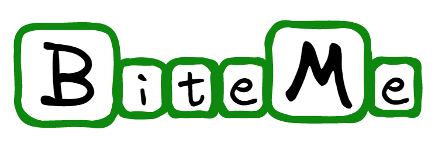
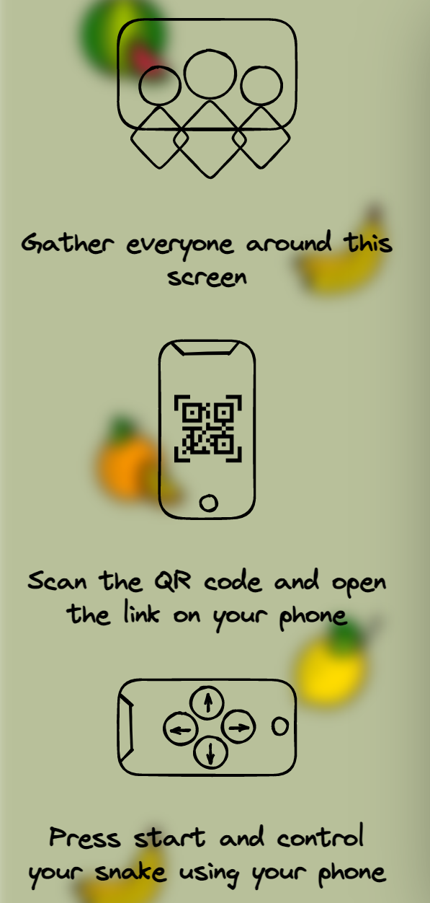
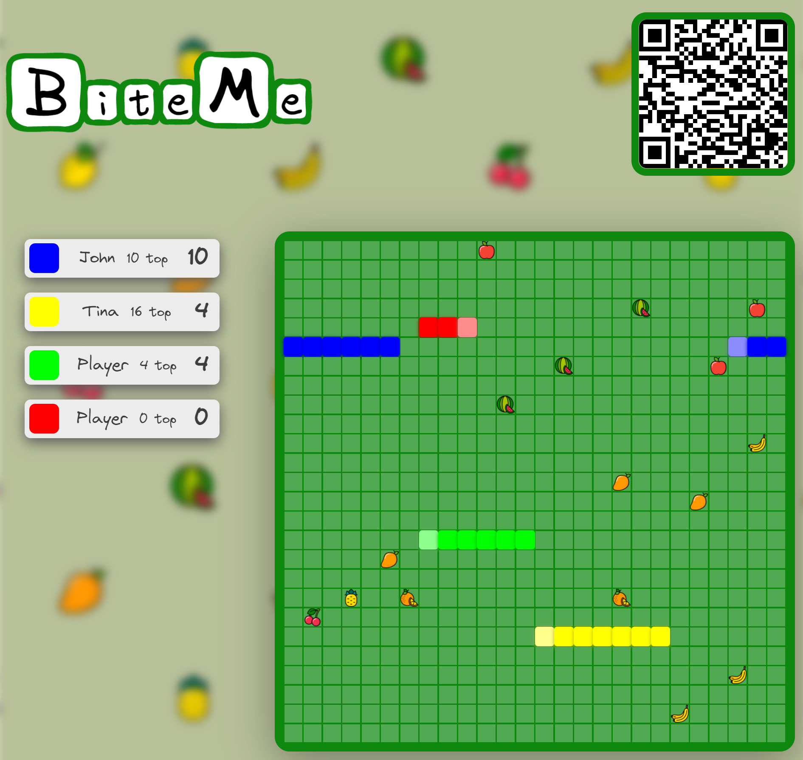
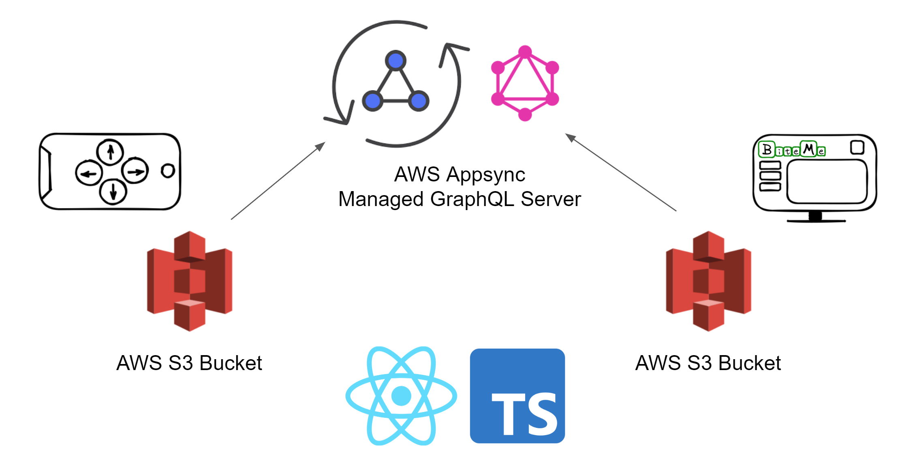

# 💻 Gamescreen for BiteMe


BiteMe is an online multiplayer snake game, 
where one player shares the game screen and others control their snake using their phone. 
Here is a [short explanatory video](https://www.youtube.com/watch?v=LK3VkUqv2XU).

## Runs on
- node v16.14.2

## Start
```bash
npm i
npm start
````

#### Env variables
- REACT_APP_REGION  - aws region of graphql
- REACT_APP_ACCESS_KEY_ID - aws access key id for graphql
- REACT_APP_SECRET_ACCESS_KEY - aws secret access key for graphql
- REACT_APP_API_URL - url to graphql
- REACT_APP_CONTROLLER_URL - qr code url redirect

## Design
### Rules


### GameBoard
- there are 8 types of food
- scoreboard keeps top score for the whole game as well as per life

  

## Tech stack
- React, Typescript
- AWS AppSync

  

# Game Architecture
## Components composition
```tsx
<>
    <NavBar>
      <Logo/>
      <QR code/> {/*redirects to you to conroller with correct screenID*/}
    <NavBar/>
    <Game> {/*Game logic (ticking, growing, food, scores, players...)*/}
      <NewPlayerLogic/> {/*handles graphQL subscription and mutations*/}
      { players ? 
        <Rules/> : // show rules if no players, otherwise show scoreboard
        <Scoreboard>
          <Player/> {/*Player score details*/}
        <Scoreboard/> } 
      <Board/> {/*rendering of snakes, foods, board*/} 
    <Game/>
</>
```

## States
#### Counter
- type: `number`
- ensures that the game renders at each tick rather than at change of other states

#### Players
```ts
type TDirections = 'UP' | 'DOWN' | 'RIGHT' | 'LEFT';

interface IPlayerSchema {
    direction: TDirections,
    color: string,
    playerId: string,
    screenId: string,
    name: string,
    toGrow: number,
    __typename: string,
}

interface IRealTimeData {
    data: {
        onPositionUpdated: IPlayerSchema
    }
}
```
- stores all players that ever joined the game, does not delete the ones that died
- allows for them to rejoin without the need to refresh the controller (`playerId` stays the same);

#### Positions
```ts
export interface IPositionSchema {
    row: number,
    col: number,
}

export interface IAllPositions {
    [key: string] : IPositionSchema[],
}
```
- most up-to-date position of all active players and the snakes
- snake body is an array of coordinates

#### Foods
```ts
export type TFood = 'apple' | 'banana' | 'cherries' | 'lemon' | 'mango' | 'orange' | 'pineapple' | 'watermelon'

export interface IFood {
    position: IPositionSchema,
    type: TFood,
}
```
- most up-to-date position of all foods

#### Board
```ts
export type TBoard = ({[key: string]:string } | string | null)[][]
```
- abstract representation of the board in the form of array of arrays (rows and cols)
- if there is `food = 'banana' | ...`
- if there is `player = {[playerId]: 'BODY' | 'HEAD`}

#### Scores
```ts
export interface IScore {
    food: number,
    status: boolean,
    highest: number,
}

export interface IScores {
    [key: string]: IScore,
}
```
- keeps tabs on highest score as well as current score
- sorted by current score


## Adjustable inputs - in `src/consts.ts`
- `FOOD_COEFFICIENT` - amount of food spawned
- `MIN_LENGTH` - starting length of snakes 
- `TICK` - speed of the game
- `KILL_BONUS` - points for killing a snake

## Rules
- there are only 3 directions a snake can go (forward, left, right; no backwards)
- by "killing" a snake (if a snake runs into you and dies) you can get extra points

## Caveats
- Doing U turn too fast (i.e. within one tick) will result in the direction being ignored and the snake would continue as previous direction. 
- If both snakes will hit the same spot at the same time, they pass through each other - for each of them the algorithm determined that the next cell is empty

# CICD
## CI
1. github workflow on feature branches to build a package  - using makefile to execute the commands
2. github workflow on master branch to build a package as well as release to S3 - release dev bucket - using makefile to execute commands as well as gulpfile for zipping
3. github workflow on tag to build a package and release to both S3 - release stable bucket

In simple words, everytime I push something to a feature branch, github will try to build a package that is ready to be deployed (npm run build). 
Everytime I push to master branch, not only will a package be created but a version file will be added to the build. 
This build is then saved as an artifact on github as well as saved to the S3 release bucket

## CD
- on push to master, deploy to staging - happening in the infrastructure repository

Everytime I push to master (merge pull from feature), a workflow on my infrastructure repository is triggered.
This will copy latest version from the S3 release bucket and deploy it to the public staging bucket.
From there the static files are served.

## Resources
- [inspiration for ticks](https://bookout.co.il/2020/07/16/cool-snake-with-react-hooks/)
- [deployment to S3](https://ljmocic.medium.com/deploying-react-application-to-aws-s3-using-github-actions-85addacaeace)
